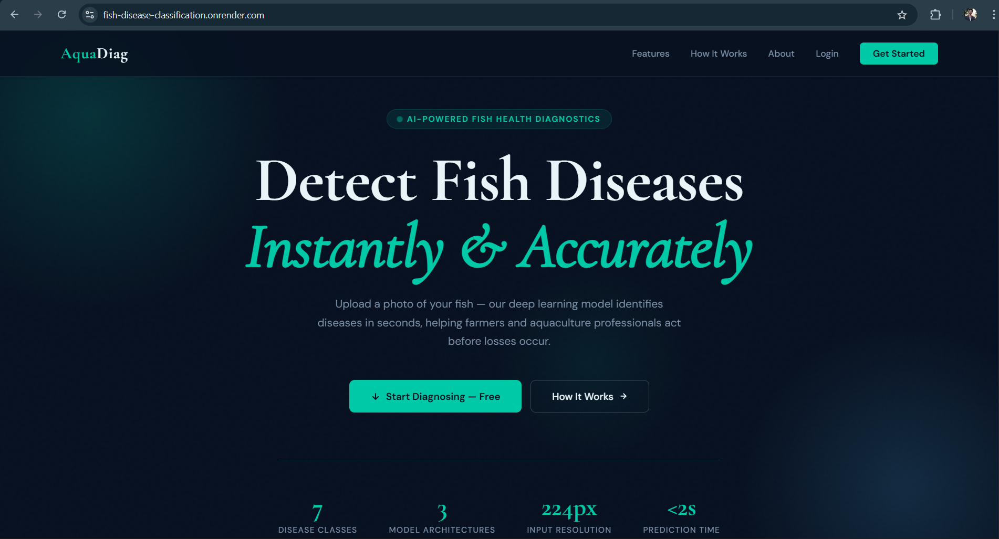
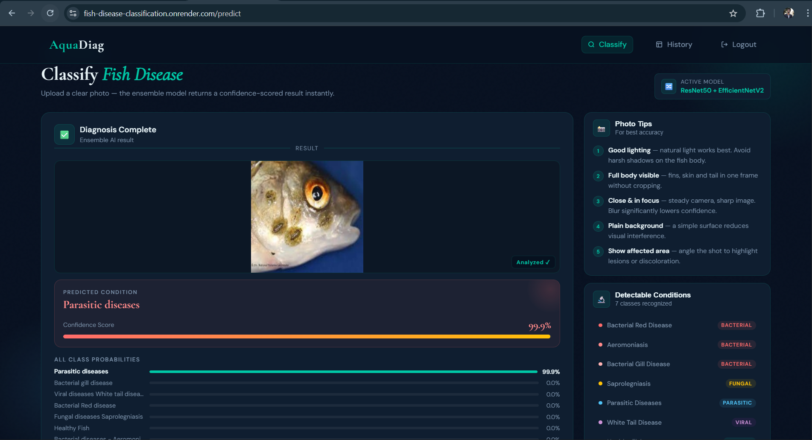
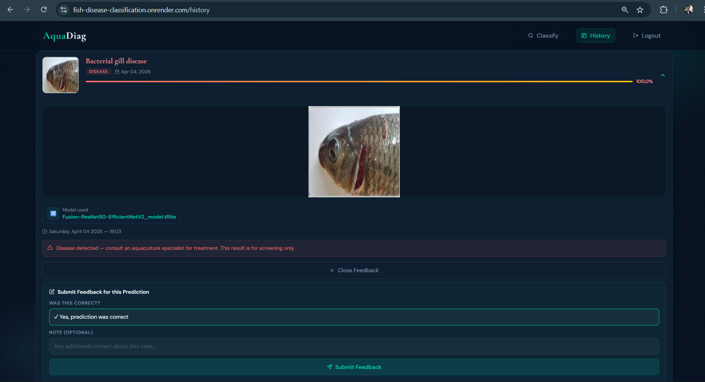
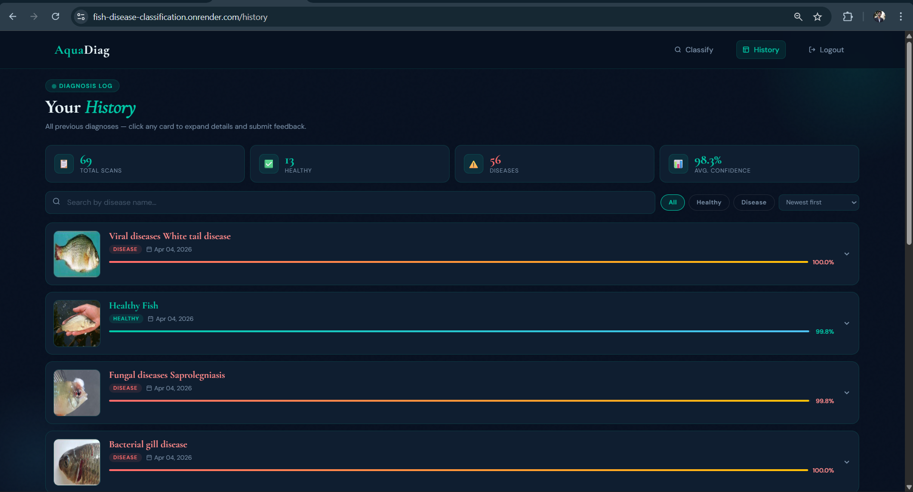
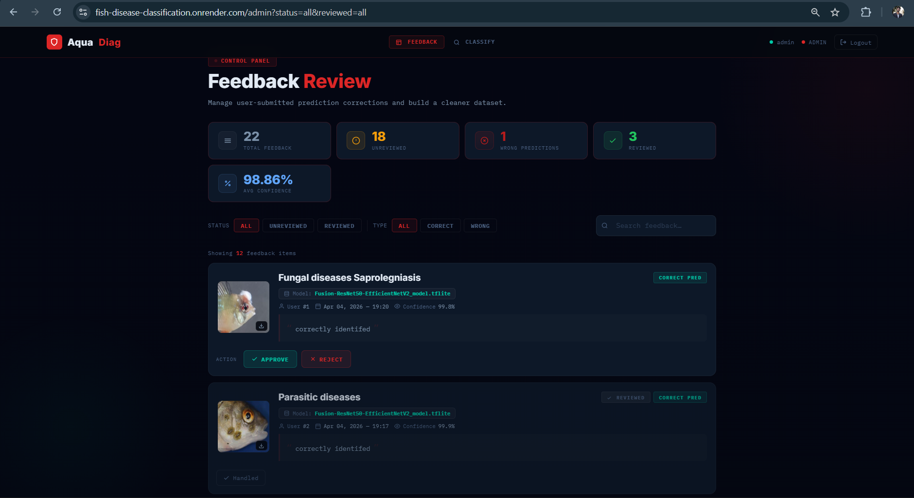

# 🐟 Fish Disease Classification using Deep Learning

<p align="center">
  
  
  
  
  
</p>

> A production-ready, research-driven AI system for automated fish disease detection, optimized for low-resource environments.

---

## 📌 Overview

This project presents an end-to-end **Deep Learning-based Fish Disease Classification System** designed for real-world aquaculture applications.

* Upload fish images
* Get instant disease predictions
* Track history and feedback

The system is optimized for **low-memory cloud deployment** using **TFLite inference**.

---

## 🏆 Research Publication

* **Title:** *Revolutionizing Aquatic Epidemiology: A Scalable Deep Learning Framework for Disease Detection and Enhancing Environmental Resilience*
* **Conference:** ICCIT 2026 (IEEE)
* **Status:** ✅ Accepted & Presented (Publication coming soon)

### 🔎 Indexing

* [IEEE Xplore](https://ieeexplore.ieee.org/)
* [Scopus](https://www.scopus.com/)
* [Google Scholar](https://scholar.google.com/)

---

## 🌐 Live Demo

🚀 [https://fish-disease-classification.onrender.com](https://fish-disease-classification.onrender.com)

---


## 📥 Sample Dataset

You can browse and download example images from this Kaggle dataset (download any image and try the app) or you can try with your own image:

https://www.kaggle.com/datasets/subirbiswas19/freshwater-fish-disease-aquaculture-in-south-asia

---

## 🧠 Model Contribution

* Custom-trained deep learning model
* `Feature fusion` of **ResNet50 + EfficientNetV2**
* `Custom classification head`
* Converted from `.h5` → `.tflite`

### 🤗 Model Hosting

Model is hosted on Hugging Face and downloaded dynamically:
[https://huggingface.co/mahfujr403/Fusion-ResNet50-EfficientNetV2_model](https://huggingface.co/mahfujr403/Fusion-ResNet50-EfficientNetV2_model)


to clone model repository:  
`git clone https://huggingface.co/mahfujr403/Fusion-ResNet50-EfficientNetV2_model`


---

## ✨ Features

* User authentication (Login/Register)
* Role-based access (Admin/User)
* Image-based prediction
* Confidence score & probability breakdown
* Prediction history
* Feedback system
* Cloudinary storage + local fallback
* Lazy model loading

---

## 🔄 System Architecture

```
User → Flask → Preprocess → TFLite Model → Prediction → Database → UI
       ↓
   Hugging Face (Model Download)
```

---

## 🛠️ Tech Stack

* Flask
* TensorFlow Lite
* NumPy, Pillow
* Hugging Face Hub
* Cloudinary
* Render + Gunicorn

---

## 📂 Project Structure

```
app.py
aquadiag/
models/
scripts/
static/
templates/
```

---

## ⚙️ Setup

```bash
git clone https://github.com/mahfujr403/Aquatic-Epidemiology---Fish-Disease-Classification.git
cd project
pip install -r requirements.txt
python app.py
```

---

## 🌱 Environment Variables

```
SECRET_KEY=
DATABASE_URL=
HF_MODEL_ID=
HF_MODEL_FILE=
CLOUDINARY_*
```

---

## 📸 UI Screenshots

| Home                             | Prediction                          |
| -------------------------------- | ----------------------------------- |
|  |  |

| Feedback                             | History                             |
| ---------------------------------- | ----------------------------------- |
|  |  |  

| Admin Pannel                         |
| ---------------------------------- | 
|  | 


---

## 🔮 Future Work

* Explainable AI
* Mobile integration
* Auto retraining

---

## 👨‍💻 Author

[**Md. Mahfujur Rahman**](https://www.linkedin.com/in/mahfujr403/)

---

## 📢 Note for Recruiters

* End-to-end ML system
* IEEE accepted research
* Real deployment
* Resource-efficient design
